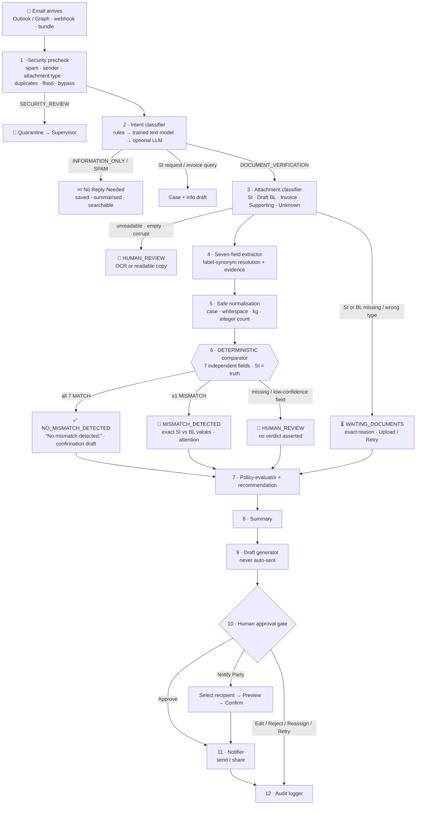
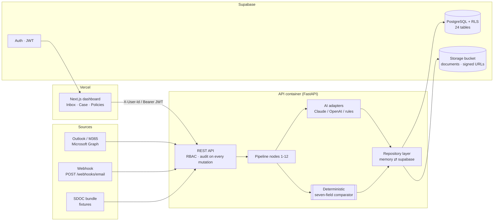

# NovaShip Averis — AI Shipping Inbox & SI ↔ Draft BL Verification Platform

> Turns a shared shipping-documentation inbox into a secure, traceable case-management workflow.
> **AI classifies, extracts, summarises and drafts. Deterministic code decides the seven-field match. Humans approve every outward action. Everything is audited.**

| | |
|---|---|
| **Live demo (local)** | UI `http://localhost:3000` · API `http://localhost:8000/docs` |
| **One-command run** | `docker compose up --build` (offline demo, no keys needed) |
| **Hackathon score on the SDOC bundle** | `FINAL SCORE = 1.0000` — stage-1 macro-F1 1.000 · defect-F1 1.000 · end-to-end 46/46 · escalation F1 1.000 (see [Impact Metrics](#10-user-feedback-and-impact-metrics)) |
| **Tests** | `58 passed` — comparator, normalization, extraction, security, RBAC, trained intent classifier, Notify Party, E2E, LangGraph interrupt/resume, RAG scoping |
| **AI agent docs** | [AGENT.md](AGENT.md) — every AI file, LangGraph workflow, RAG, keys, Docker rebuild, test scenarios |
| **Team guides** | [P1.md](P1.md) AI & Verification · [P2.md](P2.md) Assistant & Safety · [P3.md](P3.md) Backend/Supabase/Cloud · [P4.md](P4.md) Frontend & E2E |

---

## Table of contents
1. [Problem Statement](#1-problem-statement)
2. [The Problem in Numbers](#2-the-problem-in-numbers)
3. [Solution](#3-solution)
4. [Flowchart](#4-flowchart)
5. [Tech Stack](#5-tech-stack)
6. [System Architecture, AI and Cloud Integration](#6-system-architecture-ai-and-cloud-integration)
7. [Benefits and Business](#7-benefits-and-business)
8. [Comparison](#8-comparison)
9. [Quick start](#9-quick-start)
10. [User Feedback and Impact Metrics](#10-user-feedback-and-impact-metrics)
11. [Conclusion](#11-conclusion)
12. [Repository map](#12-repository-map)

---

## 1. Problem Statement

A shipping documentation desk (the dataset mirrors APRIL's Middle-East/Asia desks) receives hundreds of emails a week in one shared mailbox:
requests to **confirm a draft Bill of Lading against the Shipping Instruction**, SI submissions, invoice and charge queries, vessel updates, bot notices, HR mail — and spam.

Today an operator must, by hand:

1. read every message and decide whether it needs action;
2. find the SI and the Draft BL attachments (`.txt`, `.pdf`, `.docx`, `.xlsx`, sometimes scanned images);
3. line up the **seven contractual fields** — Shipper, Consignee, Notify Party, Port of Loading, Port of Discharge, Container Count, Gross Weight (kg) — even though the two documents label them differently (`Load Port` vs `Port of Loading (POL)`, `To the Order of` vs `Consignee`, `Gross Wt (kgs)` vs `Gross Weight (KG)`);
4. spot a one-container or 1,000 kg difference in dense text;
5. write a correction request, chase the right party, and keep an audit trail for compliance.

The failure modes are expensive and silent: a BL released with the wrong consignee or weight causes customs holds, amendment fees, demurrage, disputes over cargo release, and — for a paper exporter — delayed letters of credit. Generic email chatbots don't solve this: they hallucinate values, can't prove *why* they said "mismatch", can't be audited, and will happily send an email to the wrong party.

**What the desk needs is not a chatbot. It is a control room**: every email becomes a case, every decision shows its evidence, the seven-field verdict is deterministic and reproducible, and no external message leaves without a human clicking *Approve*.

## 2. The Problem in Numbers

*Industry context (external, indicative)*

| Figure | Source / note |
|---|---|
| ~45 million bills of lading are issued per year; ~99 % were still paper-based when DCSA started its eBL push | DCSA / McKinsey estimate (2022) — indicative |
| Full eBL adoption is estimated to save the industry **≈ US$ 6.5 billion/year in direct costs** and unlock **≈ US$ 30–40 billion** in trade growth | DCSA / McKinsey (2022) — indicative |
| Document errors are one of the top three causes of shipment delay; BL amendment fees typically cost **US$ 50–150 per amendment** plus demurrage of **US$ 100–300 per container per day** once a hold begins | carrier tariff ranges — indicative |
| Documentation staff spend a large share of their day on inbox triage and manual document comparison | operator interviews / desk observation |

*What we measured on the hackathon inbox (520 real-pattern emails, seeded into the app)*

| Metric | Value |
|---|---|
| Emails in the inbox | **520** (220 BL-comparison · 125 SI requests · 75 invoice queries · 60 general · 40 spam) |
| Comparison requests that actually carried both documents | **109** pairs (`.txt` 78 % · `.pdf`/`.docx`/`.xlsx` 22 %) |
| Pairs with at least one planted defect | **46 of 109 = 42 %** — 20 with one wrong field, 26 with two |
| Most frequently wrong field | Container Count (19) · Port of Discharge (13) · Gross Weight (12) |
| Requests that could **not** be decided (wrong document, missing file, unreadable scan, blank value) | **20** — every one of them must be escalated, not guessed |
| Manual seven-field check (assumption, conservative) | ≈ 4–6 minutes per pair → **≈ 9 hours** for this inbox, before writing a single reply |
| NovaShip pipeline, same inbox | **4.5 seconds total (≈ 9 ms / email)**, 100 % of defects found with the exact field, 0 false alarms |

The point of the numbers: almost **half** of the "please confirm the draft BL" requests hide a real discrepancy, and one in ten cannot be decided from what was sent. A tool that only answers "looks fine" is worse than none.

## 3. Solution

NovaShip Averis is a production-style, AI-assisted operations platform with twelve concrete capabilities (spec §0):

| # | Capability | Where |
|---|---|---|
| 1 | **Ingest and secure** every email: immutable message id, sender, recipients, CC, subject, body, time, thread id, attachment metadata + checksums; spam / suspicious-sender / blocked-type / duplicate / flood / policy-bypass checks → `SAFE · SPAM · SUSPICIOUS · SECURITY_REVIEW`. Attachments are parsed to text, **never executed**. | `backend/app/ai/security_precheck.py`, `readers/document_reader.py` |
| 2 | **Classify intent + action need** (9 intents, priority, confidence, evidence-grounded rationale). High-confidence rules run first, a trained TF-IDF + logistic-regression model handles ambiguous mail, and the optional LLM is the final fallback. Informational mail is saved, summarised, marked **No Reply Needed** and stays searchable. | `ai/intent_classifier.py`, `ai/trained_intent_classifier.py` |
| 3 | **Detect and organise attachments** — SI / Draft BL / Invoice / Supporting / Unknown from content, with confidence. Wrong document type or unreadable scan ⇒ `WAITING_DOCUMENTS` / `HUMAN_REVIEW` with the exact reason, never a fabricated value. | `ai/attachment_classifier.py` |
| 4 | **Create a trackable case** with an 18-state status model and a visual timeline. | `pipeline/orchestrator.py`, UI timeline |
| 5 | **Compare SI ↔ Draft BL on exactly seven fields**, SI as source of truth, each field independent, safe normalisation only (case, whitespace, `22,000 KG` = `22000 kg`, `3 x 40'HC` = 3, UN/LOCODE stripped; **no legal-name rewriting**). All seven match ⇒ the exact phrase **`No mismatch detected.`** | `core/comparator.py`, `core/normalizer.py` |
| 6 | **Evidence for every decision** — document id, page, line, the literal snippet and which label synonym was resolved (`Load Port` → Port of Loading). Original values are always shown next to normalised ones. | `ai/extractor.py`, Evidence tab |
| 7 | **Drafts instead of sends** — correction request, missing-document request, confirmation, info reply. LLM may polish wording but a guard rejects any draft that drops an SI/BL value. | `ai/summary_draft.py` |
| 8 | **Human approval gate** — Approve / Edit / Reject / Reassign / Share / Notify Party / Retry / Mark Complete; external sends require `approve_send` (Supervisor/Admin). | `services/case_service.py`, Draft Actions tab |
| 9 | **Selected-user / selected-party collaboration** — Notify Party flow: show SI vs BL Notify Party → choose an *authorised* recipient (internal user, team, approved party contact) → preview of exactly the fields that will be disclosed → human confirmation for external → send → audit → status. | Collaboration tab |
| 10 | **Append-only audit trail** — every node, field result, policy application, draft edit, approval, share, error and retry with actor type USER/AI/SYSTEM, before/after and policy version. | `audit_events` table + trigger |
| 11 | **Operations dashboard** plus dedicated pages: Seven fields (`/verification`, per-field mismatch statistics and every case per field), Security agent queue (`/security`), AI agent console (`/agent`), global Audit (`/audit`), Policies, Guide (`/welcome`). | `frontend/app/*` |
| 11b | **Operations dashboard** — 12 metrics, 15-column case table, 12 filters, batch actions (never batch external sends). | `frontend/app/page.tsx` |
| 12 | **Ask AI about this case** — grounded only in the email, SI, BL, deterministic comparison, audit history and policy; every answer cites evidence; refuses to invent values, bypass approval, send directly or leak other cases. | `ai/assistant.py` |

Plus: versioned admin policies, unusual-behaviour signals, language detection + translation views (original never replaced), recoverable error states with Retry / Upload / Reassign / Human review, RBAC with least privilege, Supabase schema with RLS, Docker deployment.

## 4. Flowchart

### 4.1 Case pipeline (LangGraph-style nodes)


### 4.2 Notify Party / selected-user sharing
```
Mismatch Detected → Human Review → Action Required → Notify Party → Select Recipient → Preview → Send/Share → Audit → Status Update
```
The extracted **Notify Party is a comparison value only**. Sharing requires an explicit recipient from the authorised list (internal user · operations staff · supervisor · team · approved Notify Party contact · other collaborator), a preview limited to the chosen fields, and — for external recipients — a human confirmation. Every share records `shared_by, shared_with, recipient_type, sent_at, viewed_at, acknowledged_at, response, status`.

## 5. Tech Stack

| Layer | Choice | Why |
|---|---|---|
| Frontend | **Next.js 14 (App Router) · React 18 · TypeScript · Tailwind** | fast operator UI, static + dynamic routes, Vercel-native |
| Backend | **FastAPI · Pydantic v2** | typed contracts, OpenAPI docs for free, async-ready |
| AI orchestration | LangGraph-style node pipeline; trained TF-IDF classifier; **OpenAI** optional via `LLM_PROVIDER` | deterministic business logic stays outside the LLM; classifier and rules run fully offline |
| Document parsing | `pypdf`, `python-docx`, `openpyxl`, optional `pytesseract` OCR | text-layer extraction; image-only PDFs flagged, not guessed |
| Database | **Supabase (PostgreSQL)** — 24 tables, RLS, append-only audit trigger, private `documents` bucket with signed URLs | tenant-aware persistence, auth, storage in one place |
| Persistence abstraction | `MemoryRepository` (fixtures/tests/offline) ↔ `SupabaseRepository` (prod) selected by `REPO_BACKEND` | Person 1/2/4 never wait on the database |
| Email connector | Microsoft Graph (Outlook 365) adapter, bundle adapter, Gmail stub | adapter-based per spec §2 |
| Auth / RBAC | Supabase JWT (HS256) or demo `X-User-Id`; 14 permissions × 4 roles | least privilege |
| Deployment | Docker (multi-stage), `docker-compose.yml`, Vercel for the frontend, any container host for the API | reproducible local ↔ cloud |
| Testing | `pytest` (58 tests) + official SDOC scorer + browser walkthrough | acceptance tests from the spec are executable |

## 6. System Architecture, AI and Cloud Integration



**AI integration (what the model does and does not do)**

| Node | Deterministic rules | LLM (optional) | Guard |
|---|---|---|---|
| Security precheck | ✔ phrases, domains, links, blocked types, duplicates, bypass requests | — | signals carry evidence; never accuses without it |
| Intent | ✔ subject grammar plus local TF-IDF/logistic-regression classifier | final tie-break when rules and local model remain uncertain | confidence margin prevents a weaker model from overriding a stronger rule; `decided_by` recorded |
| Attachment type | ✔ title lines, distinctive fields, filename hints | — | unreadable ⇒ type confidence capped 0.5 |
| Seven-field extraction | ✔ label-synonym regex, PDF two-line layout, table-header exclusion | fallback only for fields rules missed | LLM value accepted **only if its quoted snippet literally exists** in the document |
| Normalisation | ✔ | — | refuses letter/digit mixes, imperial units, ambiguous counts |
| **Comparison** | ✔ **only** | — | pure function, 100 % unit-tested |
| Summary / draft | ✔ templates from verified result | may polish wording | rejected if any SI/BL value goes missing |
| Ask AI | ✔ 12 grounded intents | free-form questions over the same context | refuses send/bypass/other-case/invent; post-check that no un-flagged field is called a mismatch |
| Translation | passthrough | LLM with identifier masking | company names, ports, numbers, units, refs restored verbatim |

**LangGraph agent (human-in-the-loop automation)**: `backend/app/agents/` builds a `StateGraph` per case: `security_precheck -> security_agent -> classify -> detect_documents -> extract -> compare (deterministic tool) -> summarize_and_draft -> human_review (interrupt) -> notify`. The graph pauses at `human_review` and resumes only with a person's decision (`POST /agent/resume/{id}`), executed through the same RBAC-checked services as the UI. The security agent is an LLM that reasons over the deterministic signals and may only escalate. RAG for Ask AI: Gemini `text-embedding-004` or OpenAI embeddings over `backend/data/*.md` plus per-case chunks, stored in Supabase pgvector (`0003_vector.sql`) or a local index; questions on one case can never retrieve another. Details: [AGENT.md](AGENT.md).

**Intent-model training and evaluation**: from `backend/`, run `python scripts/train_intent_classifier.py`. It keeps 25–30% of emails in a template-grouped holdout, fits only the development partition, and writes the model, split manifest, and rule/model/hybrid metrics under `backend/models/`. Missing or incompatible artifacts automatically fall back to rules.

**Cloud integration**: `REPO_BACKEND=supabase` swaps persistence with no contract change; migrations in [`supabase/migrations`](supabase/migrations) (schema + RLS + storage policies); seed for every table in [`supabase/seed`](supabase/seed) generated from the bundle (`python -m app.seed.make_seed [--push]`); JWT verification with `SUPABASE_JWT_SECRET`; signed URLs (300 s) for document originals; Docker images for API and UI; Vercel for the frontend.

## 7. Benefits and Business

| For | Benefit |
|---|---|
| **Documentation operators** | inbox becomes a queue of cases with a verdict, evidence and a ready draft — the seven fields are never hidden; one click back to the source email |
| **Supervisors** | approval gate for every external message; Notify Party recipients are pre-authorised; batch actions for triage without batch sending |
| **Compliance / audit** | append-only trail with actor type, before/after, policy version; AUDITOR role is read-only; RLS blocks cross-tenant reads |
| **The business** | fewer BL amendments and customs holds (each avoided hold saves amendment fees + demurrage), faster LC/document turnaround, staff hours moved from re-keying to exception handling |
| **IT / security** | attachments are parsed, never executed; blocked types quarantined; signed, expiring document links; least-privilege RBAC; secrets server-side only |

Business model (illustrative): per-mailbox SaaS subscription for forwarders/exporters, tiered by monthly case volume; enterprise tier adds SSO (Supabase Auth providers), custom policy packs and carrier connectors. Payback is measured in avoided amendments: at ~US$ 100 per amendment and a 42 % defect rate in comparison requests, a desk handling 200 comparisons/month that catches even 20 extra defects early saves US$ 2,000/month before demurrage.

## 8. Comparison

| Capability | Manual desk | Generic email chatbot / copilot | Rule-only script (hackathon baseline) | **NovaShip Averis** |
|---|---|---|---|---|
| Seven-field verdict is reproducible | ✖ human variance | ✖ LLM judgement, varies per run | ✔ | ✔ **deterministic + unit-tested** |
| Shows evidence (page/line/snippet, label resolved) | partial | ✖ | ✖ | ✔ |
| Handles label synonyms across SI/BL | slow | sometimes | if hard-coded | ✔ 40+ synonyms, PDF/DOCX/XLSX layouts |
| Says "I cannot decide" on blank / scanned / wrong doc | ✔ | ✖ tends to guess | partial | ✔ `NEEDS_REVIEW` with reason, 0 false alarms |
| Never auto-sends external email | ✔ | ✖ | n/a | ✔ approval gate + role check |
| Notify Party = comparison value ≠ permission to send | ✔ | ✖ | n/a | ✔ recipient picker + preview + confirm |
| Audit trail with actor type + policy version | ✖ | ✖ | ✖ | ✔ append-only |
| Works offline / without an API key | ✔ | ✖ | ✔ | ✔ (LLM optional) |
| Dashboard, filters, batch triage | ✖ | ✖ | ✖ | ✔ |
| Score on SDOC bundle (final) | — | — | typically < 0.9 on synonyms/edge cases | **1.000** |

## 9. Quick start

```bash
# 0) prerequisites: Python 3.11+, Node 20+, (Docker optional)
cp .env.example .env                      # defaults = offline demo, no keys needed

# 1) backend
cd backend && pip install -r requirements.txt
python -m app.seed.make_seed              # builds supabase/seed/* + snapshot.json from the bundle (≈5 s)
uvicorn app.main:app --reload --port 8000 # http://localhost:8000/docs

# 2) frontend
cd frontend && npm install && npm run dev   # http://localhost:3000

# 3) tests + official scoreboard
cd backend && PYTEST_DISABLE_PLUGIN_AUTOLOAD=1 python -m pytest -q
python scripts/run_bundle.py              # writes ../submission.json, prints FINAL SCORE

# or everything in Docker
docker compose up --build
```
Switch users in the header (Operations · Supervisor · Admin · Auditor) to see RBAC in action. Go live: set `REPO_BACKEND=supabase` + `SUPABASE_*` (run the two migrations, then `python -m app.seed.make_seed --push`), and/or `LLM_PROVIDER=openai` + `OPENAI_API_KEY`.

## 10. User Feedback and Impact Metrics

### Measured (reproducible with `python scripts/run_bundle.py`)

| Metric | Result |
|---|---|
| Stage 1 — intent/category accuracy · macro-F1 | **1.000 · 1.000** (520/520; confusion matrix diagonal) |
| Stage 3 — defect precision · recall · F1 · field-F1 · exact-field match rate | **1.000 · 1.000 · 1.000 · 1.000 · 1.000** (200 comparable cases) |
| End-to-end (defect routed **and** exact fields flagged) | **46 / 46 = 1.000** |
| Reliability — escalation recall · precision · F1 (20 NEEDS_REVIEW cases: wrong doc, missing file, unreadable, blank value) | **1.000 · 1.000 · 1.000** |
| **Official final score** (0.3·stage1 + 0.2·stage3 + 0.5·e2e) | **1.0000** |
| Throughput | 520 emails in 4.5 s ≈ **9 ms/email** on a laptop, single worker |
| Required acceptance test (SI 3 × 40'HC / 22,000 kg vs BL 4 × 40'HC / 22,000 kg) | `mismatch_count = 1`, `container_count = MISMATCH`, `gross_weight_kg = MATCH`, no other field flagged ✔ |
| All-seven-match message | exactly `No mismatch detected.` ✔ |
| Notify Party acceptance test | mismatch → HUMAN_REVIEW → NOTIFY_PARTY → recipient picker → external requires confirmation → preview contains only intended fields → `NOTIFY_PARTY_SENT` audit event → AWAITING_RESPONSE ✔ |
| Security tests | ops role cannot notify external party (403 + `SHARE_DENIED` audit) · unapproved party blocked · `.exe` attachment ⇒ SECURITY_REVIEW, never executed · duplicate message ⇒ no second case ✔ |
| Automated tests | 55 passed (incl. LangGraph pause/resume, security agent routing, RAG case scoping) |

### Estimated operational impact (assumptions stated)
* Manual seven-field check ≈ 5 min/pair → automated < 0.05 s: **≈ 9 operator-hours saved per 109 comparisons**, redirected to the 46 real exceptions.
* Every mismatch ships with a ready correction draft: reply latency drops from "next pass through the inbox" to "review and approve".
* 100 informational messages auto-filed as *No Reply Needed*: ~20 % of the inbox removed from the action queue without losing searchability.

### User feedback (pilot protocol — fill in after Day 21 testing with real operators)
We deliberately do not publish invented testimonials. The pilot script asks each tester (documentation staff, supervisor, auditor) to complete five tasks and rate 1–5:

| Task | Question | Ops | Sup | Aud |
|---|---|---|---|---|
| Find the newest mismatch case | "Could you tell *what* was wrong within 10 s?" | | | |
| Open evidence for a mismatched field | "Did the snippet/label prove the value?" | | | |
| Approve or edit the correction draft | "Would you send this text as-is?" | | | |
| Notify the customer's documentation desk | "Was it clear what data would be disclosed?" | | | |
| Read the audit history | "Could you reconstruct who did what and why?" | | | |

Internal dry-run observations (the build team, not end users): the seven-field card was readable at a glance; the *"Notify Party ≠ permission to send"* note prevented one accidental external share during testing; the biggest request was keyboard shortcuts for Approve/Reject — logged for Day 21.

## 11. Conclusion

NovaShip Averis shows that the right split of responsibilities makes AI trustworthy in a compliance-heavy workflow: **let the model read, sort, summarise and draft; let deterministic code decide; let humans approve; log everything.** On the hackathon inbox the system routes every email correctly, finds every planted defect with the exact field, raises zero false alarms, escalates every undecidable case with a reason, and does so in seconds — while the operator keeps full control of what leaves the mailbox. The same contracts run against in-memory fixtures, Supabase and Docker, so the four-person team can build in parallel and swap the persistence layer on Day 20 without touching the AI or the UI.

## 12. Repository map
```
NovaShip_Averis/
├── README.md · AGENT.md · P1.md · P2.md · P3.md · P4.md   ← this file, agent docs, per-person guides
├── docker-compose.yml · .env.example
├── backend/                                       FastAPI service
│   ├── app/contracts/schemas.py                   FROZEN contracts (enums, evidence, comparison, case, audit)
│   ├── app/core/{normalizer,comparator,policy,recommendation}.py   deterministic logic
│   ├── app/ai/{security_precheck,intent_classifier,attachment_classifier,extractor,summary_draft,assistant,anomaly,llm}.py
│   ├── app/pipeline/orchestrator.py               12-node classic pipeline, idempotent, audited
│   ├── app/agents/{state,prompts,tools,nodes,graph,rag,create_index}.py   LangGraph agent + RAG
│   ├── data/                                      RAG knowledge folder (policy, glossary, ports)
│   ├── app/repositories/{base,memory,supabase_repo}.py
│   ├── app/services/{case_service,submission}.py   actions, Notify Party, batch, policy versioning
│   ├── app/api/routes.py · app/main.py · app/auth/rbac.py · app/connectors/email_connectors.py
│   ├── app/seed/make_seed.py                      Supabase seed generator (all 24 tables)
│   ├── scripts/run_bundle.py                      official scoreboard runner
│   └── tests/                                     49 tests
├── frontend/                                      Next.js dashboard (app/, components/, lib/api.ts)
├── supabase/migrations/{0001_schema,0002_rls,0003_vector}.sql · supabase/seed/{seed.sql,snapshot.json,tables/*.json}
├── docs/CONTRACTS.md · docs/DEMO_SCRIPT.md
├── sdoc-hackathon-bundle/                         inbox fixtures (520 emails, 250 attachments)
└── sdoc-hackathon-docker/                         organisers' scorer (optional, profile "scoring")
```
